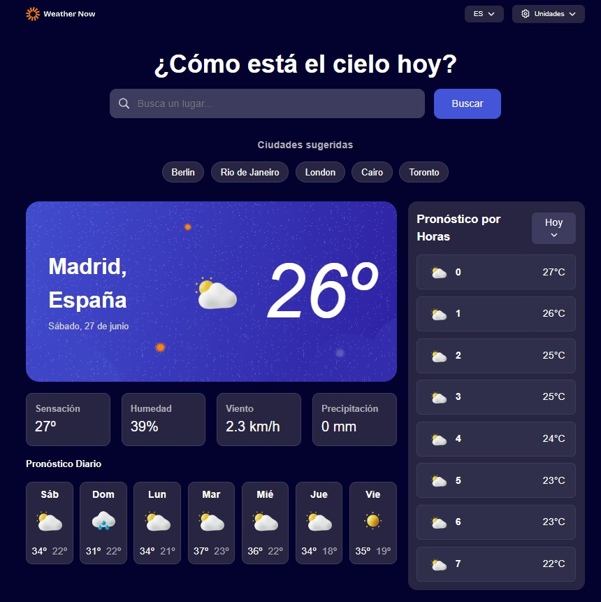

# Aplicación del clima

Aplicación web del clima desarrollada. Permite consultar el tiempo actual, el pronóstico diario y por horas de cualquier ciudad, con soporte para unidades métricas/imperiales e internacionalización en español e inglés.



## Características

- Búsqueda de ciudades con autocompletado y sugerencias predefinidas
- Detección automática de la ubicación del usuario al cargar la aplicación
- Condiciones actuales: temperatura, icono del tiempo, ubicación y hora local
- Métricas adicionales: sensación térmica, humedad, velocidad del viento y precipitación
- Pronóstico de 7 días con temperaturas máximas/mínimas e iconos del tiempo
- Pronóstico por horas con selector de día
- Cambio de unidades (temperatura, viento y precipitación) entre sistema métrico e imperial
- Interfaz bilingüe (inglés / español)
- Diseño responsive con estados de hover y focus en los elementos interactivos
- Manejo de estados de carga y error con opción de reintentar

## Tecnologías

- HTML5, CSS3 y JavaScript (ES modules)
- [Open-Meteo API](https://open-meteo.com/) — datos meteorológicos y geocodificación
- [Nominatim (OpenStreetMap)](https://nominatim.org/) — geocodificación inversa para la ubicación del usuario
- Fuentes: [DM Sans](https://fonts.google.com/specimen/DM+Sans) y [Bricolage Grotesque](https://fonts.google.com/specimen/Bricolage+Grotesque)

No requiere clave API ni dependencias de npm: es un proyecto estático que se ejecuta directamente en el navegador.

## Estructura del proyecto

```
weather-app-main/
├── index.html              # Estructura de la interfaz
├── styles.css              # Estilos y variables CSS
├── style-guide.md          # Colores, tipografías y breakpoints de diseño
├── assets/
│   ├── fonts/              # DM Sans y Bricolage Grotesque
│   └── images/             # Iconos, logos e imágenes del tiempo
└── js/
    ├── app.js              # Lógica principal y eventos
    ├── api/
    │   └── openMeteo.js    # Peticiones a la API del clima
    ├── i18n/
    │   └── translation.js  # Traducciones EN / ES
    ├── ui/
    │   └── render.js       # Actualización del DOM
    └── utils/
        ├── constants.js    # Códigos WMO e ciudades sugeridas
        └── helpers.js      # Funciones auxiliares
```

## Cómo ejecutar la aplicación

La aplicación usa módulos ES (`import`/`export`), por lo que debe servirse mediante un servidor local y no abrirse directamente como archivo (`file://`).

**Opción 1 — Live Server (VS Code / Cursor)**  
Instala la extensión Live Server y abre `index.html` con *Open with Live Server*.

**Opción 2 — npx serve**

```bash
npx serve .
```

**Opción 3 — Python**

```bash
python -m http.server 8000
```

Después abre `http://localhost:8000` (o el puerto que indique la herramienta) en el navegador.

## API

Los datos meteorológicos provienen de [Open-Meteo](https://open-meteo.com/):

- **Documentación:** [https://open-meteo.com/en/docs](https://open-meteo.com/en/docs)
- **Geocodificación:** [https://open-meteo.com/en/docs/geocoding-api](https://open-meteo.com/en/docs/geocoding-api)
- Gratuita, sin clave API y con uso razonable sin límites estrictos para proyectos personales

Ejemplo de endpoint de pronóstico:

```
https://api.open-meteo.com/v1/forecast?latitude=52.52&longitude=13.41&current_weather=true
```

## Diseño

La interfaz sigue la guía de estilo del desafío original. Consulta [`style-guide.md`](./style-guide.md) para colores, tipografías y breakpoints de referencia (375px móvil, 1440px escritorio).

## Créditos

- Datos del clima: [Open-Meteo](https://open-meteo.com/)
- Geocodificación inversa: [OpenStreetMap / Nominatim](https://nominatim.org/)
